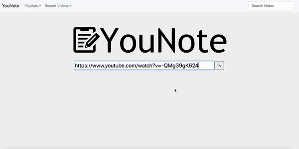

# YouNote - Notetaking Companion
YouNote is a notetaking productivity app used to integrate a text editor and video player. YouNote creates a separate page for each video and allows a seamless integration of a traditional editor and stickynotes so that users can take notes while watching educational and/or self-help videos. 



This MVP project was designed and built under 72 hours to illustrate the bare-bone concept. You can find the [full video demo here](https://www.youtube.com/watch?v=KvQkuKVrP70).


## Getting Started
Prerequisites: Node 6 or above

You can use [nvm](https://github.com/creationix/nvm#installation) to easily switch Node versions.

### Installation

```sh
npm install
```

```sh
npm run react-dev
npm start
```

Then open [http://localhost:3000/](http://localhost:3000/) to see the app.<br>

## Built With
* React 16
* Webpack 4
* Babel 7
* Node.js
* Express

